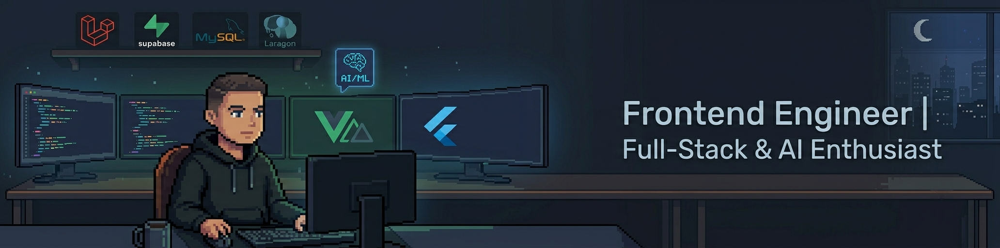

  

## 🚀 About Me

I am a **23-year-old Frontend Engineer** with over **2.5+ years of hands-on experience** building high-quality web and mobile applications since my university days. Currently, I work as a **Full-Stack Programmer within a healthcare institution**, managing complex, real-world data systems while actively taking on **freelance opportunities**.

While my core specialization lies in crafting seamless, pixel-perfect user experiences using **Nuxt.js, Laravel, and Flutter**, I am actively scaling up my expertise in modern backend architecture and **AI/ML workflows**. I possess strong capabilities in leveraging AI tools for machine learning demonstrations, manipulating data training pipelines, and building smarter, end-to-end technical solutions that empower users.

---

### 📊 What I'm Up To
- 🏢 **Day Job:** Architecting and maintaining production-grade software solutions in a fast-paced healthcare environment.
- 💼 **Freelancing:** Available for web and mobile development—specializing in dashboard applications, interactive landing pages, and API integrations.
- 🧠 **AI/ML Integration:** Exploring ways to bridge machine learning demonstrations and intelligent data features with modern frontend systems.
- 🌱 **Deep Diving:** Advanced backend design patterns, modern database optimization, and high-fidelity UI animations with GSAP.

---

### 🛠️ Tech Stack & Tools

  <a href="https://skillicons.dev">
    <!-- Baris 1: Isinya 11 ikon pertama -->
    
  </a>

  <a href="https://skillicons.dev">
    <!-- Baris 2: Isinya sisa 10 ikon berikutnya -->
    
  </a>

---

### 📈 GitHub Analytics

  

---

### 🤝 Connect & Collaborate

  
  

 

  <i>"Code is like humor. When you have to explain it, it’s bad." – Cory House</i>

